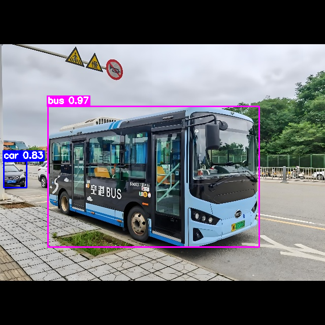
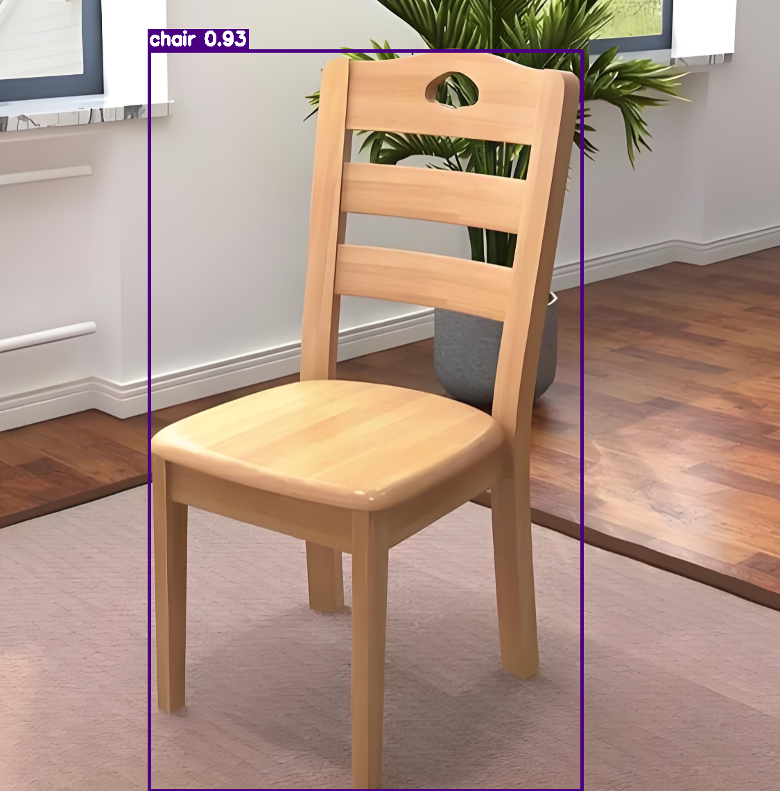

<div align="center">

# YOLO26 TensorRT（Detect）

**High-performance YOLO26 Object Detection powered by NVIDIA TensorRT**

[](https://isocpp.org/)
[](https://developer.nvidia.com/cuda-toolkit)
[](https://developer.nvidia.com/tensorrt)
[](./LICENSE)

[Features](#features) • [Model Zoo](#model-zoo) • [Visual Results](#-visual-results) • [Requirements](#requirements) • [Build](#build) • [Usage](#usage) • [Architecture](#architecture)

</div>

---

## 📌 Overview

This project delivers a **production-grade C++/CUDA implementation** of [YOLO26](https://github.com/ultralytics/ultralytics) object detection, optimized end-to-end on **NVIDIA TensorRT** for maximum inference throughput and minimum latency.

The entire pipeline — from image preprocessing to network forward to bbox decoding — runs fully on GPU, eliminating CPU-GPU data transfer overhead. It supports all YOLO26 model scales (n/s/m/l/x) and multiple precision modes (FP32 / FP16 / INT8), making it suitable for both edge deployment and data center inference.

Key highlights:

- Native TensorRT network construction from plain-text `.wts` weights
- Hand-optimized CUDA kernels for preprocessing and postprocessing
- Custom TensorRT V3 plugin for anchor-grid bbox decoding
- Support for image folder, video file, and live webcam input
- Standalone Python inference script for rapid prototyping

---

## ✨ Features

| Feature | Description |
| --- | --- |
| **Multi-scale Model Support** | Full support for YOLO26-n / s / m / l / x detection variants |
| **Multi-precision Inference** | FP32, FP16, and INT8 (with calibration placeholder) |
| **GPU-accelerated Preprocess** | Letterbox resize + bilinear interpolation + channel swap + normalization, all on CUDA |
| **GPU-accelerated Postprocess** | Argmax + CUB DeviceRadixSort + top-K gather, zero CPU involvement |
| **Custom TRT Plugin** | `IPluginV3` implementation for efficient anchor-grid bbox decoding |
| **Flexible Input Modes** | Image batch (`-d ... p`), video file (`-d ... s`), live webcam (`-d ... c`) |
| **Python Bindings** | Standalone Python inference script via TensorRT Python API |

---

## 📊 Model Zoo

All models are evaluated on COCO val2017 at 640×640 input resolution.

| Model | mAP50 | mAP50-95 | Precision | Recall |
| --- | --- | --- | --- | --- |
| YOLO26-n | 55.7% | 40.1% | 64.9% | 50.7% |
| YOLO26-s | 64.6% | 47.8% | 69.7% | 58.1% |
| YOLO26-m | 69.8% | 52.5% | 73.3% | 62.9% |
| YOLO26-l | 71.5% | 54.3% | 74.2% | 64.1% |
| YOLO26-x | 74.1% | 56.8% | 74.9% | 66.9% |

>
> Weights download: [YOLO26 Official Platform](https://platform.ultralytics.com/ultralytics/yolo26)

---


## 🖼️ Visual Results
Below are example inference outputs and performance benchmarks of YOLO26-s running in FP16 mode on NVIDIA RTX 40-series GPU at 640×640 resolution.

### Detection Samples
<div align="center">
    
  
</div>

### Latency & FPS Benchmark
End-to-end latency breakdown per frame (batch=1, FP16, 640×640 input):

| Stage                | Time (µs) | Time (ms) | Proportion | fps |
|:---------------------|----------:|----------:|:----------:|:---:|
| Preprocessing        | 152 | 0.152 | 10.3% |  /  |
| Inference            | 1230 | 1.230 | 83.0% | 813 |
| Postprocessing  | 99 | 0.099 | 6.7% |  /  |
| **Total end-to-end** | **1481** | **1.481** | **100%** | 675 |

> **Single-stream(Preprocessing + Inference + Postprocessing): ≈ 675 FPS**
> 
> Test platform: NVIDIA RTX 4060 / CUDA 12.6 / TensorRT 10.7

### Model‑size Performance Estimation (640×640, batch=1, FP16, RTX‑4060)
> Estimated end‑to‑end FPS for YOLO‑n / s / m / l / x family

| Model | Est. Total Latency (ms) | Est. End‑to‑end FPS |
|:-----:|------------------------:|:-------------------:|
| ‑n    |                  ≈ 1.17 |        ≈ 854        |
| ‑s    |                  ≈ 1.48 |        ≈ 675        |
| ‑m    |                  ≈ 2.31 |        ≈ 432        |
| ‑l    |                  ≈ 2.85 |        ≈ 350        |
| ‑x    |                  ≈ 5.23 |        ≈ 191        |

> Note: Values are empirical estimates scaled from your measured ‑n / ‑s results, actual FPS may vary slightly with TensorRT optimization, NMS overhead and GPU runtime load.

### Numerical Consistency

Only FP32 numerical alignment has been verified so far:

- Zero error for 640×640 inputs.
- Pre‑processing error < 1 pixel (255‑scale) for non‑integer input sizes.
- Inference: max absolute error < 1e‑5, max relative error < 1e‑5.
- Post‑processing: error‑free.

FP16 
- Inference: max absolute error < 1e‑3, max relative error < 1e‑3.

INT8
- Inference: max absolute error < 1e‑1, max relative error < 1e‑1.

### Performance Comparison

<table border="0" style="width: 100%; text-align: left; margin-top: 20px;">
  <tr>
      <td>
          <video src="https://github.com/user-attachments/assets/f158009a-1f45-4097-99de-65ecacc5a511" width="320" controls loop></video>
          <p align="center">demo1.mp4</p>
      </td>
      <td>
          <video src="https://github.com/user-attachments/assets/87b93474-ecf3-4a58-b573-0b66876a6484" width="320" controls loop></video>
          <p align="center">demo2.mp4</p>
      </td>
  </tr>
</table>


> All test images are included in the `images/` directories from [Baidu Pan](https://pan.baidu.com/s/1LKNBbtejD3B_fXesBKwJXg?pwd=rmf2)
> 
> To generate your own visualization results, run inference and check outputs in `output/`.


---

## 📋 Requirements

| Component | Linux Specification | Windows Specification |
| --- | --- | --- |
| **OS** | Ubuntu 20.04+ | Windows 11 |
| **GPU** | NVIDIA GPU with Compute Capability ≥ 7.5 (e.g. RTX 30/40 series) | Same |
| **CUDA Toolkit** | 12.6 | 11.8 |
| **cuDNN** | 9.x | 8.9 |
| **TensorRT** | 10.7.0 | 8.6.1 |
| **OpenCV** | 4.10+ (CUDA backend recommended) | 4.10+ |

---

## 🛠️ Build

### 1. Clone the repository

```
git clone https://github.com/<your-username>/yolo26-tensorrt.git
cd yolo26-tensorrt
```

### 2. Configure dependency paths

Edit `CMakeLists.txt` and update the paths according to your environment:

```
# Linux
set(CUDA_ROOT "/usr/local/cuda-12.6")
set(TENSORRT_ROOT "/path/to/TensorRT-10.7.0.23")

# Windows
set(CUDA_ROOT "C:/Program Files/NVIDIA GPU Computing Toolkit/CUDA/v11.8")
set(TENSORRT_ROOT "S:/TensorRT-8.6.1.6")
set(OPENCV_ROOT "S:/opencv/build")
```

### 3. Compile

```
mkdir build && cd build
cmake .. -DCMAKE_BUILD_TYPE=Release -Wno-dev
make -j$(nproc)
```

---

## 🚀 Usage

### Step 0: Download model weights & config

Download `.pt` checkpoints from the official YOLO26 platform:

- [yolo26n](https://platform.ultralytics.com/ultralytics/yolo26/yolo26n)
- [yolo26s](https://platform.ultralytics.com/ultralytics/yolo26/yolo26s)
- [yolo26m](https://platform.ultralytics.com/ultralytics/yolo26/yolo26m)
- [yolo26l](https://platform.ultralytics.com/ultralytics/yolo26/yolo26l)
- [yolo26x](https://platform.ultralytics.com/ultralytics/yolo26/yolo26x)

Download model architecture YAMLs:
[YOLO26 configs on GitHub](https://github.com/ultralytics/ultralytics/tree/main/ultralytics/cfg/models/26)

### Step 1: Convert PyTorch weights → `.wts`

```
python yolo_pt2wts.py -w ./file/yolo26s.pt -o ./file/yolo26s.wts -t detect
```

### Step 2: Serialize TensorRT engine

```
# Example: build YOLO26-s engine in FP16 mode
./yolo26_det -s ../file/yolo26s.wts ../file/yolo26s.engine s fp16
```

### Step 3: Run inference

```
# Run on image folder
./yolo26_det -d ../file/yolo26s.engine ../images p

# Run on video file
./yolo26_det -d ../file/yolo26s.engine ../images/fruit.mp4 s

# Run on live webcam
./yolo26_det -d ../file/yolo26s.engine 0 c
```

Output results are saved to the `output/` directory by default.

### Python inference (optional)

A standalone Python script is provided for quick validation:

```
python yolo26_det.py
```

---

## 📁 Project Structure

```
yolo26-tensorrt/
├── CMakeLists.txt           # Build configuration
├── yolo26_det.cpp           # Main entry (serialize / infer)
├── yolo26_det.py            # Python TensorRT inference
├── yolo_pt2wts.py           # PyTorch → .wts converter
├── include/
│   ├── config.h             # Global constants
│   ├── block.h              # Network blocks (Conv, BN, SiLU, C3k2, PSA, etc.)
│   ├── model.h              # Backbone / Neck / Head definition
│   ├── preprocess.cuh       # CUDA preprocessing interface
│   ├── postprocess.cuh      # CUDA postprocessing interface
│   ├── cuda_utils.h         # CUDA error-checking macros
│   ├── utils.h              # I/O, drawing, GPU utilities
│   ├── logging.h            # TensorRT logger
│   └── macros.h             # Export / compatibility macros
├── src/
│   ├── block.cpp            # Layer implementations
│   ├── model.cpp            # Full model assembly
│   ├── preprocess.cu        # CUDA kernel: letterbox + resize + normalize
│   ├── postprocess.cu       # CUDA kernel: argmax + sort + gather
│   └── utils.cpp            # I/O, bbox drawing, GPU info
├── plugin/
│   ├── yololayer.h          # TensorRT V3 plugin header
│   └── yololayer.cu         # Anchor-grid bbox decoding plugin
├── file/                    # Model weights, configs, labels
│   ├── coco.txt             # COCO 80-class labels
│   ├── yolo26*.yaml         # Model architecture definitions
│   ├── yolo26*.pt           # PyTorch checkpoints
│   └── yolo26*.wts          # Exported weight files
├── images/                  # Sample images and videos
├── output/                  # Inference results
└── test/                    # Preprocessing validation scripts
```

---

## 🏗️ Architecture

The TensorRT network is constructed in four stages:

```
┌──────────────────────────────────────────────────┐
│                    Backbone                      │
│  Conv → C3k2 → Conv → C3k2(P3) → Conv → C3k2(P4)│
│       → Conv → C3k2(P5) → SPPF → C2PSA         │
├──────────────────────────────────────────────────┤
│                      Neck                        │
│  Upsample → Concat → C3k2 → (repeat for P3/P4/P5)│
├──────────────────────────────────────────────────┤
│                      Head                        │
│  Detect × 3 scales (box regression + class score)│
├──────────────────────────────────────────────────┤
│                   Postprocess                    │
│  Anchor decode (TRT Plugin) → Sigmoid → Concat  │
│         → GPU argmax → CUB sort → Top-K gather   │
└──────────────────────────────────────────────────┘
```

---

## ⚡ GPU Performance Tuning (Optional)

For consistent benchmarking on NVIDIA GPUs, lock GPU clock frequencies:

```
# Lock clocks for stable performance
sudo nvidia-smi -pm 1
sudo nvidia-smi -lgc 3150,3150
sudo nvidia-smi -lmc 8000
nvidia-settings -a "[gpu:0]/GPUPowerMizerMode=1"

# Reset to default after benchmarking
sudo nvidia-smi -pm 0
sudo nvidia-smi -rgc
sudo nvidia-smi -rmc
nvidia-settings -a "[gpu:0]/GPUPowerMizerMode=0"
```

---

## 🙏 Acknowledgments

- [ultralytics/ultralytics](https://github.com/ultralytics/ultralytics) — Official(8.4.120) YOLO26 PyTorch implementation
- [NVIDIA/TensorRT](https://developer.nvidia.com/tensorrt) — High-performance inference SDK
- [wang-xinyu/tensorrtx](https://github.com/wang-xinyu/tensorrtx) — TensorRT deployment reference architecture

---

## 📄 License

This project is released under the [MIT License](./LICENSE).